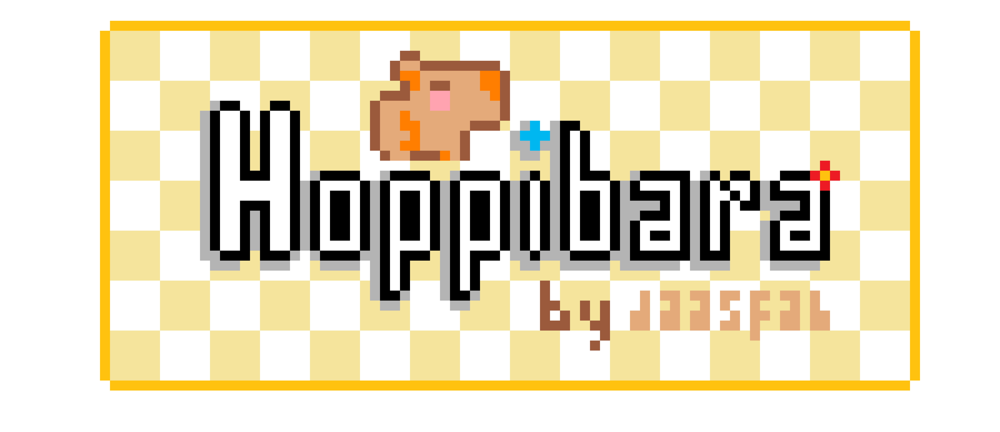

# Hoppybara

<div align="center">
  
</div>

---

## 🔍 Overview

Enjoy this 2D Infinite - Jumper style game with a lovely Capybara as the playable character!

---

## 📬 Developer Notes!!! (Updated)

The game is in progress, meaning it's not finished yet. So please wait for updates as I will be sharing them frequently right until the game is finished 👍.

- I am making the jumping mechanic be such that when the space bar (jump button) for a longer duration of time, the capibara will jump higher, and there will be a crouch feature too!
- The running animation of the capybara's feet will be added later after the more important parts of the game are completed.
- Hoppibara will be playable on the web, as I am making it supported on the WebGL platform.

---

## 📖 The Story...

Baby Capibara was playing with his friends one day, but suddenly he decided to run to his bedroom to get some toys. WAIT, what is that? Oh no, our Capy is facing numerous obstacles and *you* have to help him reach his bedroom to get his toys. 

---

## 👾 Features

- **Immersive Audio:** Custom audio linked to different actions, as well as the background music will enhance your player experience. 
  
- **Unique Game-Play Elements:** The obstacles and the Capibara will follow the same theme, having the same art style and logical additions (e.g., other capybaras as obstacles).

_(more features will be added as I develop this game further!)_

---

## 🪨 Obstacles (Will be spawned randomly procedurally)
Obstacle 1 - Basket of Fruits:
<div align="center">
  
</div>

Obstacle 2 - Basketball:
<div align="center">
  
</div>

Obstacle 3 - Toy Car:
<div align="center">
  
</div>

Obstacle 4 - Girl Capibara:
<div align="center">
  
</div>

Obstacle 5 - Chair with a Duck:
<div align="center">
  
</div>

Obstacle 6 - Toy Plane:
<div align="center">
  
</div>

---

## 📸 Gameplay Screenshots (Not Available Yet)


---

## 📥 Installation

Hoppibara will be playable by anyone! I am making it playable on the WebGL platform, meaning once the development is finished, you will be able to test it out! 😀

  
```bash
git clone https://github.com/yourusername/eclipsed-apocalypse.git
cd eclipsed-apocalypse
npm install


